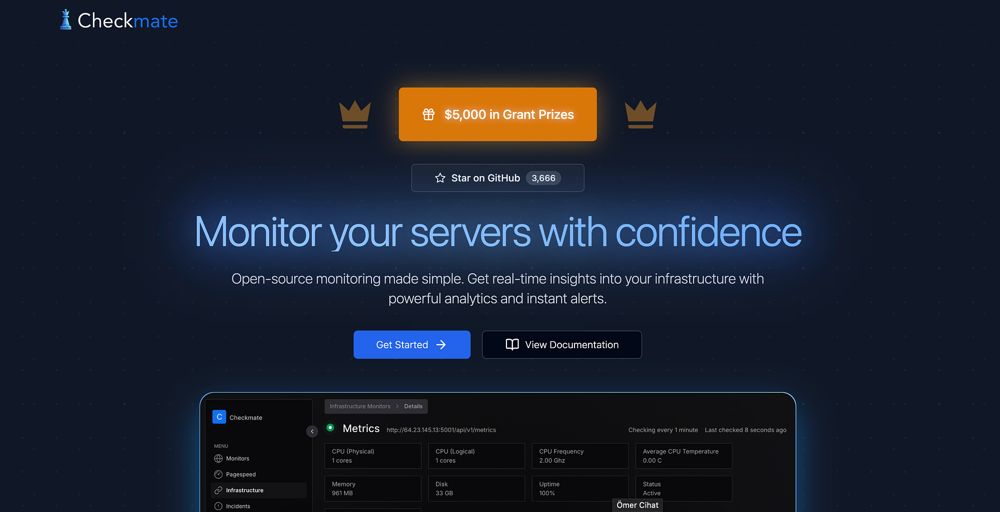
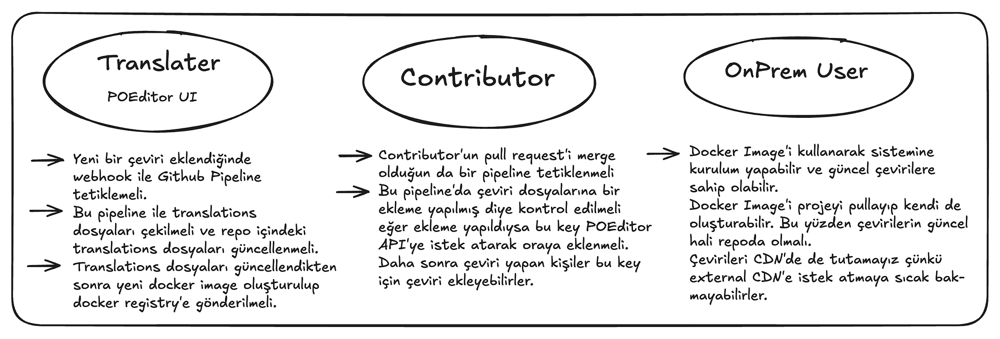

Açık kaynak projelere katkı sağlamak, hem teknik becerileri geliştirmek hem de sektörde değerli bağlantılar kurmak için harika bir fırsat. Bu yazıda, Checkmate projesine nasıl dahil olduğumu, i18n (çok dilli destek) implementasyon sürecimi ve açık kaynak katkılarının yararlarını paylaşacağım. Benim için hem keyif aldığım hem de para kazandığım bir yolculuk oldu.

### BlueWave Labs ile Tanışmam

Twitter’da uzun süredir [Görkem Çetin](https://medium.com/u/e9de96d536b4)’i SaaS alanındaki paylaşımları nedeniyle takip ediyordum. Bir gün gezinirken, [BlueWave Labs](https://github.com/bluewave-labs) organizasyonu altında başlattığı açık kaynak projeleri keşfettim ve ilgimi çekti. Birden fazla proje vardı ancak en çok hoşuma giden, onboarding sürecini yöneten **Guidefox** oldu.

Projeyi inceledikten sonra bir issue alıp katkı yapmak istedim ve **bildirim sistemi (Notification)** eklemeye karar verdim. Bunun sonucunda ilk PR’ımı açtım:
[https://github.com/bluewave-labs/guidefox/pull/188](https://github.com/bluewave-labs/guidefox/pull/188)
Bu Pull Request ile hem projeyle hem de Görkem Abi ile tanışmış oldum.

### Checkmate Yarışması ve Ödül

_Ödül_

Twitter’da gezinirken BlueWave Labs’ın **Checkmate** projesi için başlattığı bir yarışmayı gördüm. Proje için **5000$ bütçe** ayrılmıştı ve bu ödül, katkıların büyüklüğüne göre geliştiricilere dağıtılacaktı.

Bu beni oldukça heyecanlandırdı ve projeye katkıda bulunarak ödülden yararlanmak istedim. Görkem Abi ile konuşarak **i18n implementasyonu** işini aldım. Bu iş için belirlenen ödül **500$** idi.

Checkmate’den bahsedecek olursam **Checkmate**, sunucuların ve web sitelerinin çalışma durumunu ve performansını izlemek için kullanılan açık kaynaklı bir **monitoring** aracıdır. Bu araç, sunucu veya web sitesinin erişilebilirliğini düzenli olarak kontrol eder ve hizmetlerin kullanılabilirliği, kesinti süreleri ve yanıt süreleri hakkında detaylı bilgiler sunar.

**Projede Kullanılan Teknolojiler:**
\- NodeJs
\- MongoDB
\- Redis
\- React
\- Docker

### i18n Implementation sürecim

Öncelikle kod tabanını inceledim ve projeyi çalıştırmaya başladım. Kafamda bir yapı oluşturdum: **Ülkeler için elle çeviri dosyaları oluşturacak (örneğin** **tr.json), ardından seçili dile göre ilgili metni gösterecek bir sistem geliştirecektim.**

Ancak, Görkem Abi ile yaptığımız görüşmede, çevirilerin doğrudan kod tabanında bulunmasını istemediğini öğrendim. Çünkü ileride yazılım bilmeyen kişilerin de projeye katkı verebilmesi önemliydi. Çevirileri doğrudan GitHub’daki JSON dosyalarını düzenleyerek yapmak iyi bir kullanıcı deneyimi sunmazdı.

Bu nedenle, **ayrı bir SaaS çeviri aracı kullanma** fikrini değerlendirdim ve araştırma yaptım. **Düşük maliyetli ve efektif çözümler ararken öne çıkan araçlar şunlardı:**

Araştırmalarımda öne çıkan toollar:
\- [Weblate](https://weblate.org/tr/)
\- [Tolgee](https://tolgee.io/)
\- [POEditor](https://poeditor.com/)

En çok **Tolgee** hoşuma gitmişti çünkü **developer experience** açısından oldukça iyiydi ve **On-Prem** olarak kendi sunucumuza ücretsiz kurabiliyorduk. Ancak sürecin daha hızlı ilerlemesi için **cloud tabanlı** bir çözüm tercih ettik ve **POEditor**’ü seçtik. POEditor, **açık kaynak projelere destek sunduğu için** bizim için uygun bir seçenekti. POEditor’un API’lerini inceledikten sonra implementasyona başladım.

### Frontend ve Backend Tarafındaki Değişiklikler

İlk hedefim Frontend tarafındaki Authentication sayfalarına Translation desteğini getirmekti. Frontend tarafında _i18next_ ve _react-i18next_ kütüphanelerini kullanarak ilerledim. Proje reposunda tüm translation dosyaları bulunsun istemiyordum. Sadece bir adet default translation dosyası bulunsun diğer çeviri dosyalarını build aşamasında POEditor API’ye istek atarak ekliyim ancak atladığım bir nokta olmuştu.

Checkmate’i cloudda çalışacak bir SaaS gibi düşünmüştüm ama Checkmate On-Prem çalışacaktı. Bu yüzden translationları build aşamasında eklemem demek POEditor API-KEY’lerini herkesle paylaşmak demekti. Bunu da istemezdik. Bu yüzden yapıyı tekrar kurguladık. 3 Farklı durumu düşünmem gerekiyordu.

Resimde açıkladığım sebeplerden dolayı çevirileri repoda tutmaya karar verdik. Artık çevirileri Pipeline’lar ile güncelleyeceğiz. Böylelikle API-Key’i açık bir şekilde paylaşmayacağız.
Frontend tarafında seçili olan dili req.header ile backend’e gönderdim. Backend tarafında da seçili olan dile göre string dönmek için bir yapı kurdum. Açtığım Pull Requestleri aşağıya bırakıyorum.
Frontend PR -> [https://github.com/bluewave-labs/Checkmate/pull/1711](https://github.com/bluewave-labs/Checkmate/pull/1711)
Server PR ->[https://github.com/bluewave-labs/Checkmate/pull/1709](https://github.com/bluewave-labs/Checkmate/pull/1709)

Süreçteki katkılarından dolayı Görkem Abi’ye ve [Alex’e](https://github.com/ajhollid) teşekkür ederim. On-Prem ve Open Source projelerde çalışmak benim için değerli bir deneyim oldu ve farklı bir bakış açısı kazandırdı..

### Deneyim için Open Source projelere katkı

Yazılım sektöründe eskisi kadar iş imkanı maalesef yok. Bu yüzden ilginizi çeken **açık kaynak projelere katkıda bulunarak deneyim kazanabilirsiniz.**

Hatta bir işiniz olsa bile, gelişiminizi hızlandırmak için açık kaynak projelere katkı sağlamak çok faydalıdır. Çünkü:

-   **Pull Request’leriniz farklı insanlar tarafından incelenir.**
-   **Code review sürecinde birçok şey öğrenebilirsiniz.**
-   **Gerçek dünya projelerinde çalışma fırsatı bulursunuz.**
-   **Yeni insanlarla tanışarak profesyonel çevrenizi genişletebilirsiniz.**

BlueWave Labs altında birçok **açık kaynak proje** var. Eğer katkıda bulunmak isterseniz, **GitHub’daki Issues bölümüne** girerek **Good First Issue** etiketli işlerden birini seçip katkı vermeye başlayabilirsiniz.

Katkı sürecinde zorluk yaşarsanız, bana her zaman ulaşabilirsiniz! 😊
