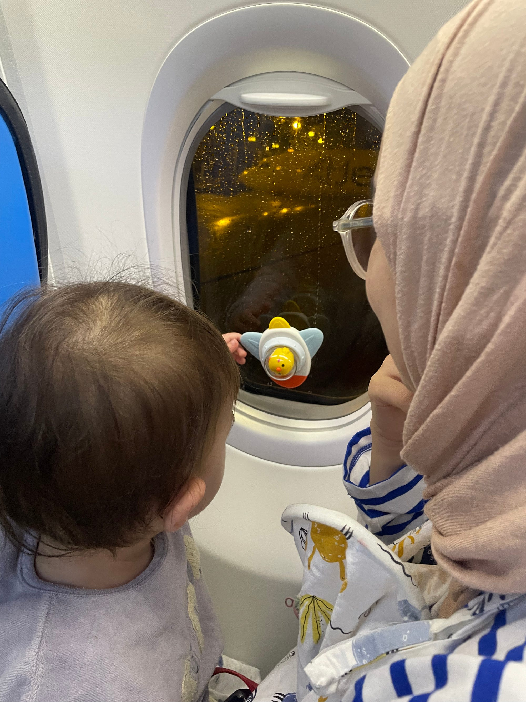

We actually took this trip in **April**. Although I took some notes after we returned, I only recently found the time to organize everything and finally publish this post. Since I thought our experience might be particularly helpful for parents planning their first international trip with a baby, I wanted to put everything together in one place.

This year, we decided to travel abroad with our baby for the first time. To be honest, we were both excited and a little nervous.

What would traveling internationally with an 11-month-old be like?

Would she cry on the plane?

Would we have trouble finding suitable food?

Would we be able to get around comfortably with a stroller?

Before the trip, we had dozens of questions like these on our minds.

## Why Uzbekistan?

Our first criterion was simple: we didn't want to deal with a visa. So we immediately ruled out countries that require Turkish citizens to obtain one.

After that, we came up with a few more criteria:

- It should be safe
- The flight shouldn't be too long
- It should be rich in history and culture
- The food should be good
- It should be easy to explore with a stroller
- The weather should be pleasant in spring

Around that time, I had been seeing a lot of videos about Central Asian countries on social media. That got me interested, so I started researching Kyrgyzstan, Kazakhstan, Uzbekistan, and Mongolia in more detail.

Kyrgyzstan and Kazakhstan looked incredibly impressive, especially for their natural beauty. However, since our baby was only 11 months old, we thought hiking trails and mountain routes would be difficult with a stroller.

Uzbekistan, on the other hand, seemed to be exactly what we were looking for.

With historic cities such as Samarkand, Bukhara, and Tashkent, it offered plenty in terms of culture and history. At the same time, the city centers seemed relatively easy to explore on foot or with a stroller.

So, we decided on Uzbekistan.

## Our Travel Plan

We planned a **5-night, 6-day trip**.

Our route was:

- Tashkent
- Samarkand
- Bukhara

Having a direct flight from Ankara to Tashkent was a huge advantage for us.

The flight took around four hours and departed at night. Leyla slept through almost the entire journey, so our first flight experience with a baby turned out to be much easier than we had expected.

## The Most Useful Thing We Brought on the Plane

Before the trip, we bought a few suction-cup toys that stick to windows and other smooth surfaces.

They ended up being some of the most useful toys we brought with us, both during the trip and especially on the return flight. They kept her entertained for surprisingly long periods on the plane.

## Our Airport Experience

Ankara Esenboğa Airport has a baby care room, which was very convenient.

At Tashkent Airport, however, we couldn't find one, at least in the areas we used.

Another thing we were curious about before traveling was how the stroller would be handled.

In both Turkey and Uzbekistan, we were able to take the stroller all the way to the aircraft door and hand it over to the staff there.

However, on the return journey, we didn't get the stroller back at the aircraft door in either country. Instead, we had to collect it from the regular baggage claim area.

This is worth keeping in mind when planning your trip, especially if you're traveling with a small baby.

## Things to Know Before You Go

### Buy Your Train Tickets Early

This is probably my most important piece of advice for anyone planning a trip to Uzbekistan.

The easiest and most comfortable way to travel between Tashkent, Samarkand, and Bukhara is by train. Tickets for the high-speed **Afrosiyob** trains, in particular, sell out very quickly during the spring months.

We left it a little too late and couldn't find tickets for the high-speed train, so we had to use a regular train instead.

As soon as your travel dates are confirmed, I recommend buying your tickets from the official website:

[https://railway.uz](https://railway.uz/)

The official website doesn't always seem to work well with foreign credit cards. I ran into this problem myself while trying to complete the payment.

If you experience the same issue, you can also try the Uzbekistan Railways mobile app or a reputable third-party ticketing platform.

### Arrive at the Train Station Early

There is a security check before entering the station.

Also, tickets aren't checked after you board the train. Instead, they are checked at the entrance to each carriage.

For this reason, I recommend arriving at the station at least **20–30 minutes before departure**.

### Bring Food and Water for the Train

There was no café or food and drink service on the train we took.

I recommend buying water and some snacks before boarding, especially if you're traveling with a child.

### Get an eSIM at the Airport

The prices were very reasonable, and we didn't experience any connectivity issues while traveling around the cities.

Instead of buying one before leaving Turkey, I'd recommend getting one after you arrive in Uzbekistan.

### Download Yandex Apps Before You Go

I strongly recommend installing **Yandex Go** and **Yandex Maps** on your phone before your trip.

Google Maps does work in Uzbekistan, but Yandex apps seem to be much more commonly used by locals.

In particular, **Yandex Go** is practically the standard app for calling a taxi.

Taxi fares were very affordable compared with Turkey. Since we were traveling with a baby, we used taxis quite frequently and never had any difficulty getting around.

## Communication

Before the trip, I watched several videos suggesting that Turkish speakers could easily understand Uzbek because of the similarities between the languages.

Once we arrived, we did recognize quite a few familiar words. However, understanding Uzbek in everyday conversation was much harder than we expected.

We particularly struggled when people spoke quickly.

That said, people were generally very helpful. A combination of simple words, gestures, and translation apps on our phones was enough to get by whenever we had trouble communicating.

## Tashkent

Tashkent honestly exceeded my expectations.

The city is very green, the roads are well organized, and the traffic was much calmer than I had expected. There are also several beautiful squares and open spaces around the city.

The Hazrati Imam Complex and the square surrounding it were particularly peaceful.

One small detail that really caught my attention was the entrance doors of houses in residential neighborhoods. Almost every house seemed to have a carefully designed front gate, and the streets themselves looked remarkably clean.

## Places We Visited

- Amir Timur Square
- Hazrati Imam Complex
- Chorsu Bazaar
- Magic City
- Tashkent Metro stations

The metro stations are attractions in their own right.

Each one has a different architectural style, and you can clearly see traces of the Soviet era in their design.

## Food

We ate at a restaurant called **Coffee 1991**, close to Amir Timur Square.

This was where I tried authentic Uzbek plov for the first time, and I really enjoyed it. The manti, on the other hand, had a little too much onion for my taste.

One interesting detail was that the plov was served with a small portion of **horse meat** on the side.

## Samarkand

After spending a day in Tashkent, we took the train to Samarkand.

Since we couldn't find tickets for the high-speed train, we traveled on a regular train instead. The journey took approximately **2 hours and 20 minutes**.

For me, Samarkand was easily the most impressive stop of our entire Uzbekistan trip.

No matter how magnificent Registan Square looks in photos, seeing it in front of you for the first time is a completely different experience.

When you arrive, you almost instinctively stop for a few minutes and simply take everything in.

The atmosphere becomes even more beautiful around sunset. Sitting among the historic madrasas and watching the square was one of the most peaceful moments of our trip.

Samarkand isn't impressive only because of its historic buildings. There's something about the atmosphere of the city itself that stays with you.

## Places We Visited

- Registan Square
- Shah-i-Zinda
- Gur-e-Amir Mausoleum
- Bibi-Khanym Mosque
- Hazrat Khizr Mosque
- Siyob Bazaar

## Food

We found the best samsa we had in Samarkand at [this place](https://maps.app.goo.gl/FSGkZhrLvfUYi8Ja8).

The shop is run by a lovely elderly woman, and the prices were very affordable. Communication with the owner was a little difficult, but if you're visiting Samarkand, I definitely recommend stopping by.

We also tried Uzbek baklava somewhere else in the city. Unfortunately, that one was not good at all.

If you're currently planning your itinerary, my biggest recommendation would be to **spend the most time in Samarkand**.

We originally divided our time fairly evenly between the cities, but after visiting Samarkand, we both wished we had stayed for another day.

For me, this is definitely the city where you can feel Uzbekistan's historic character most strongly.

## Bukhara

Bukhara feels much quieter and more peaceful than Samarkand.

With its narrow streets, historic madrasas, and earth-toned buildings, walking around the city feels a little like exploring a living open-air museum.

Even wandering through the streets without a particular destination is enjoyable.

Another thing Bukhara is great for is souvenir shopping.

You'll find souvenir shops in Tashkent and Samarkand as well, but in my experience, Bukhara offered the best combination of variety and price.

## Is Uzbekistan a Good Destination With a Baby?

**Absolutely.**

Our biggest concern before the trip was whether we'd be able to use the stroller comfortably.

Overall, we had no major problems getting around the historic areas. Some of the old stone streets were a little bumpy, but nothing that caused us serious difficulty.

People were also very friendly and helpful toward families with children, and we didn't encounter any significant problems in restaurants either.

Since this was our first international trip with a baby, we were naturally a little nervous beforehand.

In the end, however, the trip was much easier and more comfortable than we had expected.

## When Is the Best Time to Visit Uzbekistan?

We visited in spring, and in my opinion, it's one of the best times of year to travel around Uzbekistan.

The weather wasn't unbearably hot, but it wasn't cold either.

We learned that temperatures can rise above **35°C (95°F)** during the summer months, so I would especially recommend spring for families traveling with young children.

## Final Thoughts

Uzbekistan exceeded our expectations in almost every way.

With its historic cities, sense of safety, affordable prices, welcoming people, and rich culture, I think it's a particularly enjoyable destination for families traveling with children.

If you're planning your first international trip with a baby, Uzbekistan definitely deserves a place near the top of your list.
