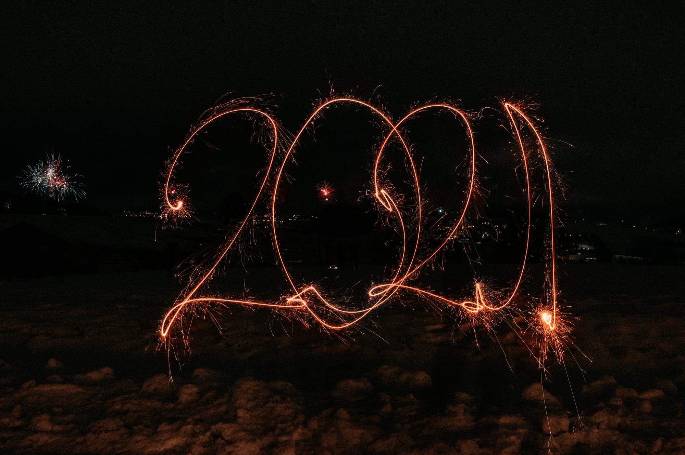

## 2021'de neler yaptım? Hardskills’den çok Softskills

_Photo by [Theo Eilertsen Photography](https://unsplash.com/@theoeilertsen?utm_source=medium&utm_medium=referral) on [Unsplash](https://unsplash.com?utm_source=medium&utm_medium=referral)_

2021’in sonuna yaklaştık, geçen sene yaptığım gibi([Geçen seneki yazı linkim](https://cihatata.medium.com/frontende-nereden-ba%C5%9Flamal%C4%B1y%C4%B1m-dedikten-sonra-1-y%C4%B1l-ge%C3%A7ti-110c777b8367)) bu sene de bir yıl sonu değerlendirme yazısı yazmak istedim. Bunu yapmamın faydası hem bana geçtiğimiz sene de neler yaptığımı düşünme fırsatı sağlıyor hem de ileri de yazıya dönüp baktığımda o sene yaptıklarım gözümde canlanıyor. Konu konu bu seneki deneyimlerimi anlatmaya çalışacağım. İsterseniz direkt en aşağıdaki genel değerlendirme kısmını okuyabilirsiniz.

### Kodluyoruz & Patika.dev

Bu sene iki farklı Bootcamp’de asistan olarak görev aldım. 2021’e Kodluyoruz’un JavaScript Bootcamp’ine asistanlık yaparak başladım. Bu eğitimde asistan olduğum için kendimi çok şanslı hissediyorum. Eğitmenimiz Mehmet Yurtar’dan bir sonraki işime girmemi kolaylaştıran bir çok şey öğrendim. Bootcamp pandemide sokağa çıkma yasaklarının olduğu döneme denk gelmişti. Akşamları katılımcılar ile Discord’da toplanıp bazen oyun oynuyorduk bazen de proje yapıyorduk. Elimden geldiğince herkesin sorusunu yanıtlamaya çalışıyordum. Sorulan soruları yanıtlamaya çalışırken ben de kendimi geliştiriyordum. Çok fazla insanla tanışıp kendime çok şey kattığım bir bootcamp oldu.

2021 Eylül’de de Patika tarafından düzenlenen Hepsiburada Frontend Bootcamp’inde asistanlık yaptım. Bu bootcamp’de de yine birçok kişiyle tanıştım. Elimden geldiğince herkese yardımcı olmaya çalıştım. Bu iki bootcampte yaklaşık 80 farklı kişiyle Discord üzerinden tanışıp sohbet ettim. Çok farklı bir deneyimdi. Bazıları ile hala görüşmeye devam ediyoruz. Ek olarak Bootcamp bittikten sonra öğrencilerden olumlu geri dönüşler aldım. Bu da beni ayrı mutlu etti 😊

### Yeni İş

Küçük bir startup firmasında güzel bir ürün üzerinde çalışıyordum. Çoğu şey güzel gidiyordu. Teknik kararları ben veriyordum. Çok fazla şey öğreniyordum ancak ürünün geliştirmesinin büyük bir kısmını tek başıma yapıyordum. Ağırlıklı olarak tek başıma çalıştığım için zamanla motivasyonumu kaybetmeye başladım. Kendimi Freelancer gibi hissetmeye başlamıştım. Bu da beni yeni iş fırsatlarına başvurmaya sevk etti. Büyük ürünlerin geliştirildiği bir firmada çalışmayı çok istiyordum. Büyük takımların işlerin nasıl yürüttüğünü merak ediyordum. İş değiştirmeyi düşündüğümde mülakatlara hazırlanmaya başladım. 1–2 hafta boyunca mesai saatleri dışında mülakatlar için çalışma yaptım. “Frontend Developer interview questions” diye arattığımda çıkan sorulara çalışıyordum. Bir yandan da beğendiğim firmalara başvuru yapıyordum. Mülakat görüşmeleri sonrası hızlı büyüyen, büyük bir e-ticaret sitesinden teklif almıştım. Teklif aldığımda çok mutlu olduğumu hatırlıyorum. Bu yıl içerisindeki en mutlu olduğum 3 andan birisidir belki. 2021 Mart ayında bu firmada çalışmaya başladım.

Yeni geçtiğim firmada hali hazırda yazılmış bir codebase vardı. İlk defa projeyi sıfırdan yazan tarafta değildim. Başkalarının yazdığı kodu anlayıp onun üzerine katkı vermem gerekiyordu ama motivasyonum çok yüksekti :) İlk codebase’e baktığımda bayağı bir korkmuştum acaba yapabilecek miyim diye kendime sorduğumu hatırlıyorum. O sıralar çalıştığım ekip Pair Programming’i çok yapıyordu ben de onları izliyordum. Pair sessionları daha hızlı adapte olmamı sağladı. Task alıp ilerletmeye başladığımda mutlu oluyordum 😊

Belli bir iş akışı vardı. Artık ürün hakkında Product kararı vermiyordum. Önüme her şey hazır geliyordu. Bana çoğunlukla işi yapmak kalıyordu. Hem domain bilgisi olarak hem de teknik açıdan çok şey öğrendiğim Code Review sessionlarımız oluyordu. En önemlisi de iletişimi yönü çok kuvvetli bir ekipte çalışıyordum. Farklı takımlarla iletişim kurup işler yürütüyordum ve birçok kişiyle tanışıp muhabbet etme şansım oluyordu. Burada 5. ayımdan sonra projeye adapte olduğumu hissetmiştim. Projeyi iyileştirmek için bazı küçük önerilerde bulunmaya başlamıştım ve daha büyük tasklar almaya başladım. Elimizdeki ana proje olgunlaşmıştı artık çok fazla büyük feature geliştirmiyorduk ama çoğu yerde deneyimleyemeyeceğim farklı iyileştirmeler üzerine çalışmalar yapıyorduk. Bu deneyimler benim için çok kıymetliydi. Önümdeki teknik engelleri aşıyordum ama yabancı dil engelini aşamadım ☹️İngilizce olan toplantılara fazla katkı veremiyordum. Bunu aşmak için çalışmalar yapıyorum ama daha çok yapmam gerekiyor galiba.

### İş Dışı Hayat

Bu sene şehir hayatından çıkıp kısa bir süre kırsal bir kesimde yaşamayı denedim. Başta güzel gidiyordu. Sessiz ve sakindi kafamı dinliyordum ancak hafta sonları çok canım sıkılıyordu sohbet edecek birilerini arıyordum ve hava karardıktan sonra dışarıda yürüyüş yapmaya korkuyordum :D Bu hayatı çok benimseyemedim ve tekrar şehir hayatına döndüm. Eskişehir’de aile evinden ayrılarak tek başıma eve çıktım. Eskişehir yaşamak için çok güzel bir şehir, tavsiye ederim burada yaşamanızı 🚀

Bu sene dolandırıldım. Malum sarı siteyi kullanırken dikkat edin insanlara güvenerek kapora göndermeyin 😂

Kahveyle daha çok uğraştığım bir sene oldu. Neredeyse her ay yeni bir ekipman aldım. Pour Over metodları dışında artık espresso’da yapmaya başladım. Evimde misafir ağırlayıp bol bol kahve ikram ettim. Evden çalışırken kahve hazırlamak için mola vermek iyi geliyor.

Son dönemde ülkenin yaşadığı ekonomik durum birçok kişi gibi beni de etkiledi. Gündemi takip etmekten üretkenliğimin düştüğü bir dönem yaşadım. Her şeye rağmen sevdiklerimle her sene olduğu gibi çok güzel anılar biriktirdim.

### Genel Değerlendirme

Bu sene sektörde çalışan veya çalışacak olan çok fazla insanla tanıştım. Network’umu geliştirdiğim bir sene oldu. Bu sene çalıştığım şirkette de büyük takımlarda nasıl işlerin yürütüldüğünü görme şansım oldu. Geçen seneye göre daha az yeni şey öğrendiğimi düşünüyorum. **_Hardskillerimden daha çok softskillerimin geliştiği bir sene oldu._** Yıl içerisinde kimi zaman iş hayat dengesini kaçırdım. Bunu daha iyi yönetmek için _Zaman Yaratmak_ kitabını okudum. Ancak okuduklarımı hayata dökmekte başarılı olamadım. Umarım 2022'de bu noktada daha başarılı olurum. İngilizce konusunda bu sene başarısız oldum. 2022'deki en büyük odak noklarımdan biri de bu olacak. 2022 daha üretken olmak istediğim bir sene umarım 2022 sonuna geldiğimde ürettiğim şeyleri buraya linkleyebilirim. Seneye görüşmek üzere 👋🏻
