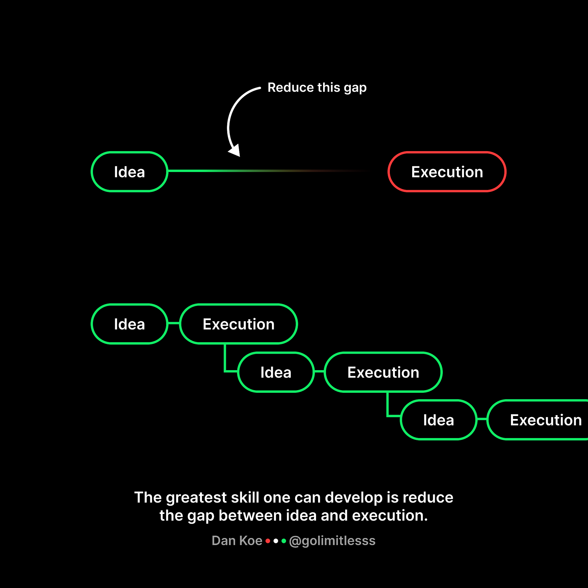

Yıllık yazımızın dördüncü serisine hoş geldiniz. Bu sene, [**geçen yılın**](https://medium.com/@cihatata/2022-de%C4%9Ferlendirmesi-tek-eksik-sayg%C4%B1nl%C4%B1k-2374489ac058) aksine oldukça stabil bir hayat yaşadım. Bu yüzden yıllık yazımı yazmak için bilgisayarın başına oturduğumda ne yazacağım konusunda düşünceye daldım. Geçen sene hayatımda birçok önemli değişiklik yaşanmıştı. Ancak bu sene benzer bir deneyim yaşamadım.

Geçen seneki yazımda bu yıl için belirlediğim dört hedeften ilki daha çok yer gezme arzusuydu. Kesinlikle bu hedefi gerçekleştirdiğimi düşünüyorum. Türkiye’nin daha önce ziyaret etmediğim birçok yerini keşfettim. Uzun zamandır kışın bir yerde kayak yapma isteğim vardı ve bu yıl snowboard ile bu deneyimi yaşadım. Eğitim almadan sadece YouTube videoları izleyerek yapabileceğimi düşündüğüm bir aktiviteydi, ancak beklediğimden daha zorlu olduğunu fark ettim. Hiç bilmeyen biri için tehlikeli olabileceğini anladım. Kendimi zorlayarak gün sonunda ufak ufak sürmeyi başarabildim. Bu deneyimi tekrar yaşamak istiyorum ve bu sefer bir hoca ile kısa bir eğitim almayı düşünüyorum :)

Diğer hedefim kişisel web sitemi oluşturmaktı ve [**cihatata.dev**](http://cihatata.dev) domaini altında kendi sitemi yayınladım. Başaramadığım hedefler arasında teknik blog yazısı ve teknik bir sunum yapmak bulunuyordu. Teknik blog yazma konusunda tembel davrandım, bu sene birçok kez denedim ama maalesef yarım bıraktım. Teknik bir sunum ise benim için biraz daha zorlu bir hedef, ancak bu konuda zamanım olduğunu düşünüyorum. Dört hedeften ikisini başarabildim. Elbette dörtte üç yapmak beni daha mutlu ederdi, bu sene biraz tembellik ettiğimi kabul ediyorum.

İki yılın ardından geçen hafta, heyecan dolu startup yolculuğunu tamamladım. 0’dan bir ürünün doğuşunu ve pazarlama süreçlerini gözlemleme fırsatı buldum. Şirket seçimi konusunda şanslıydım. Çalıştığım insanlar ve co-founderlar çok iyi kişilerdi.
Startuplar hakkında gözlemlediklerimi burada yazmaya çalışacağım. Bu kısım ileride kendime bırakacağım not gibi olacak.

### Startuplar hakkında;

Her startup kendi dinamiklerine sahiptir bu yüzden söyleyeceklerim şirketten şirkete farklılık gösterebilir. Ben son iki senedir ekosistemdeki gözlemlerimi paylaşmaya çalışacağım. Çalıştığım süre boyunca bir taraftan ürün geliştirirken diğer taraftan da Business Development, ve Marketing kısmında yapılan işleri, alınan kararları uzaktan takip etmeye çalıştım.

İlk önce; bir ürün geliştirmek ve bunu satabilmek gerçekten zor, çok çaba gerektiriyor. Çoğu insanın kafasında mükemmel bir proje bulunur ve bu projeyi gerçekleştirirse zengin olacağını düşünür. Ancak; benim en önemli önerilerimden biri, mükemmel gibi görünen fikrinizi hayata geçirmeden önce bir erken aşama (early stage) startup’ta çalışmayı deneyimlemeniz ve çevrenizi olabildiğince geniş tutmanızdır. Peki, neden böyle diyorum? Çünkü kafanızdaki mükemmel dediğiniz ürün, henüz tam anlamıyla mükemmel olmayabilir; ancak bu yolculuk, mükemmeliyete doğru adım adım yaklaşmanızı sağlayabilir. Diyelim ki mükemmel bir ürünü ortaya çıkardınız; peki, bu ürünün pazarda karşılığı var mı? Gerçekten satışa dönüştürülebilir bir ürün mü? İşte bu sorulara verilecek cevaplar, sizin daha önceki ürün geliştirme deneyimlerinizden beslenecek ve bu yolda size rehberlik edecektir. Bazı maddeleri daha detaylı yazmaya çalışacağım.

Ürününüzün pazarda bir yeri olup olmadığını anlamak için basit bir rakip araştırması yapabilirsiniz. Eğer ürününüz zaten pazarda bulunuyorsa, rakiplerinizden sizi farklı kılan özellikleri belirlemelisiniz. Bu fark, ekstra özellikler, kullanıcı deneyimi, fiyatlandırma veya tanıdıklarınızın güveniyle öne çıkabilirsiniz. Yani, kullanıcıların sizi tercih etmeleri için önemli bir nedeniniz olmalı. Eğer ürününüzün pazarı mevcut değilse, zor bir durumla karşı karşıyasınız demektir ve bu durumda pazarı yaratmanız gerekebilir. Bu noktada bireysel müşterilerle görüşüp onların yaşadığı problemleri anlamalı ve ürününüzün bu problemleri nasıl çözdüğünü açıkça ifade etmelisiniz. Müşteriler, ürününüzün onlara nasıl fayda sağladığını gördüklerinde sizi tercih edebilirler.

_by Addy Osmani_

Müşterinin karşısına olabildiğince hızlı bir MVP çıkarmalısınız. Daha sonra olabildiğince fazla insana ürünü anlatıp feedback toplamalısınız. Çevrenizin geniş olmasının bu noktada katkısı çok olacaktır. Tanıdıklarınızdan ücretsiz olarak ürünü kullanmalarını isteyin ve bu kişilerden belli aralıklarla feedbackler toplayın. Gelen feedbackler ile ürün daha hızlı olgunlaşacaktır.

Ürününüzü geliştirirken esnek olun ve bazen gerektiğinde başka bir yöne sapabileceğinizi bilin. _Çünkü startupta başarı, orijinal fikirde değil, fikrin uyarlanabilirliğinde yatmaktadır._ Ürünü geliştirirken piyasada daha önce gözden kaçırdığınız bir boşluğa yönelmek daha akıllıca olabilir.

Son madde olarak da ürün geliştirirken beraber çalıştığınız ekip çok önemli iyi product developerlara ihtiyacınız olacak. Ekip kurarken olabildiğince önceden tanıdığınız hatta beraber çalıştığınız kişileri seçmek daha iyi olabilir.

### Bir çalışan olarak hangi startupları tercih etmeliyiz?

— Bence ilk olarak parası olan startupları tercih etmeliyiz. Para durumu net olmayan şirketlerde kaos daha fazla yaşanabilir.
— Stock Option veren startuplar önceliğiniz olabilir. Geleceğinize yatırım yapmış olursunuz.
 — Founderların çevresi olan kişiler olup olmadığına dikkat edebilirsiniz. Özellikle de yaptığınız ürünün bulunduğu alanda çevresi olan insanlar olması daha iyi olabilir.
 — Founderlar daha önceden bir startup’ta çalışmış mı? Daha önceden başka bir şirkette founder olarak görev almış mı? Kurduğu ikinci şirketi ise deneyimi yüksektir ve başarılı olma ihtimali daha yüksektir.
 — Hedef ve planları belli olması önemli.

### Product Developer

Çalıştığım startup’a Frontend Developer olarak katıldım ancak Product Developer rolüne daha yakın olduğumu düşünüyorum. Özellikle early stage startuplarda, geliştiricilerin genellikle bu role daha fazla entegre olduğunu görüyorum. Büyük şirketlerde genellikle bir product manager bulunur ve ürüne eklenmesi planlanan özellikleri belirler, yapılacak işin hatlarını net bir şekilde çizmeye çalışır. Yazılım geliştiriciler, işi analiz eder ve geliştirmeye başlar; ardından tamamlandığında QA Developer’a test için yönlendirilir. Testlerde hata olmaması durumunda iş production aşamasına geçer. Ancak early stage startuplarda bu 3 rol bir yazılımcıya verilebiliyor. Nasıl yürüyor bu süreç? Yazılımcıya yapılması gereken iş özet bir şekilde aktarılıyor. Yazılımcı eklenecek feature hakkındaki yapılması gerekenleri kendi düşünüyor. Gerekirse rakip ürünleri inceliyor ve ne yapması gerektiğini kendisi detaylandırıyor. Bundan sonra geliştirme süreci başlıyor. Yazılım sürecini de tamamladıktan sonra da en son QA’liğini yine kendisi yapıyor. En sonunda herhangi bir problem yoksa feature production’a gönderiyor. Bu süreç, yazılımcının projenin her aşamasında etkin bir rol oynamasına olanak tanıyor.

Bence bu sürecin artıları ve eksileri var. Bu 3 sorumluluğu tek bir kişi yaptığı için geliştirme süreci daha hızlı ilerliyor. Hız startuplar için önemli bir nokta bu yüzden bu şekilde ilerlemek tercih edilebilinir. Ancak tek bir kişinin bu 3 sorumluluğu üstlenmesi farklı sorunlara sebep oluyor. Yazılımcı feature’u iyi analiz edemediyse proda eksik bir şekilde gidiyor. Ayrıca testlerini iyi yapmamış olabilir. Bu yüzden proda ürün hatalı olarak çıkabiliyor veya yazılımcı kodu kötü yazmış da olabilir bu da ileride başka sorunlara sebebiyet verebiliyor. Tabii bu yazılımcı, üç farklı rolü ustalıkla yerine getirmiş de olabilir. Böyle bir durumda bu yazılımcıyı elinizden kaçırmayın derim :) Herkesin bu kapsamlı rolü başarıyla yerine getiremeyeceğini düşünüyorum. _Kendimle ilgili_ a_çıkça söylemek gerekirse ben bu rolün sorumluluklarını iyi yerine getiremediğimi düşünüyorum._ Feature iyi analiz edemediğim de oldu, proda buglı feature çıkarttığım da oldu, zaman zaman kalitesiz kod da yazdım.

Günün sonunda beklenen hızla birlikte bu rolün beni yorduğunu fark ettim ve tekrar büyük takımların olduğu bir ortamda çalışmak istediğimi fark ettim.

### Özet

2 yıllık startup maceramın sonuna geldim bu startupın ilk yazılımcılarındandım. Fikir aşamasından ürüne nasıl gidildiğini deneyimleme şansım oldu. Çalıştığım co-founderlar da bizimle açık olarak her gelişmeyi paylaştılar. Kazandığım deneyimler de onların çok katkısı var. Tekrar buradan onlara teşekkür ediyorum. İlerleyen yıllarda kendi ürünümü geliştirmeye karar verdiğimde, burada edindiğim bilgi ve deneyimlerin bana büyük katkısı olacak. Startuplardaki Product Developer rolünün yazılımcının teknik gelişimini yavaşlattığını düşünüyorum. Bu rolde ana odak, istenilen özelliği hızlı bir şekilde uygulamak oluyor ve genellikle büyük teknoloji şirketlerinde olduğu gibi teknik detaylarla yoğun şekilde ilgilenmiyorsunuz. Büyük takımlarda, sorumluluklarınız daha belirgin bir alanı kapsıyor, bu da size teknik detaylara daha derinlemesine odaklanma şansı veriyor. Bu çalışma tarzının, bilgi seviyenizi daha etkili bir şekilde artırabileceğini düşünüyorum. Yeni yılda tekrar kalabalık takımlara sahip bir şirkette çalışmaya başlayacağım bunun için heyecanlıyım. Acaba early stage start-up atmosferini tekrar özleyecek miyim? Bu sorunun cevabını ilerleyen zamanlarda göreceğim:)

Yeni yılla beraber maalesef yeniden taşınacağım. Umarım bu sefer uzun vadeli oturabileceğim bir ev bulabilirim ve anlaşabileceğim iyi bir ev sahibiyle karşılaşırım. Buna ilaven desktop setup’ımı yeniden güncellemeye başladım. Gelişmeleri kişisel sitemde paylaşmaya çalışacağım. Son olarak inşallah bu sene aracımıza kimse çarpmaz çünkü bu sene park halindeyken 3 kere araca çarptılar kaza işleri beni çok uğraştırdı :) Gelelim bu yılki hedeflere:

\- Eşimle beraber yurt dışı seyahati yapmak istiyorum.
\- Geçen sene kişisel sitemi tamamlayıp yayınlamıştım ama daha sonra güncellemeler yapamadım. Bu sene web sitemi daha aktif kullanacağım ve yeni özellikler ekleyeceğim.
\- Yıl içinde bir tane teknik blog yazısı yazmak istiyorum.(Bu sene yapacağım :)
\- Web components’i öğrenmek istiyorum. Aklımda küçük bir proje var bunu web components ile yapacağım.
\- Son olarak da Refactoring kitabını okuyup bitirmek istiyorum.

Geçen sene tembel bir yıl geçirdim bu sene daha aktif olacağım. İnşallah seneye ki yazıma 5’te 5 yaptım diyerek başlayabilirim. Çok şükür bu sene önemli bir sağlık problemi geçirmedim. Bu sene de bu şekilde devam eder inşallah. Seneye görüşmek üzere.
