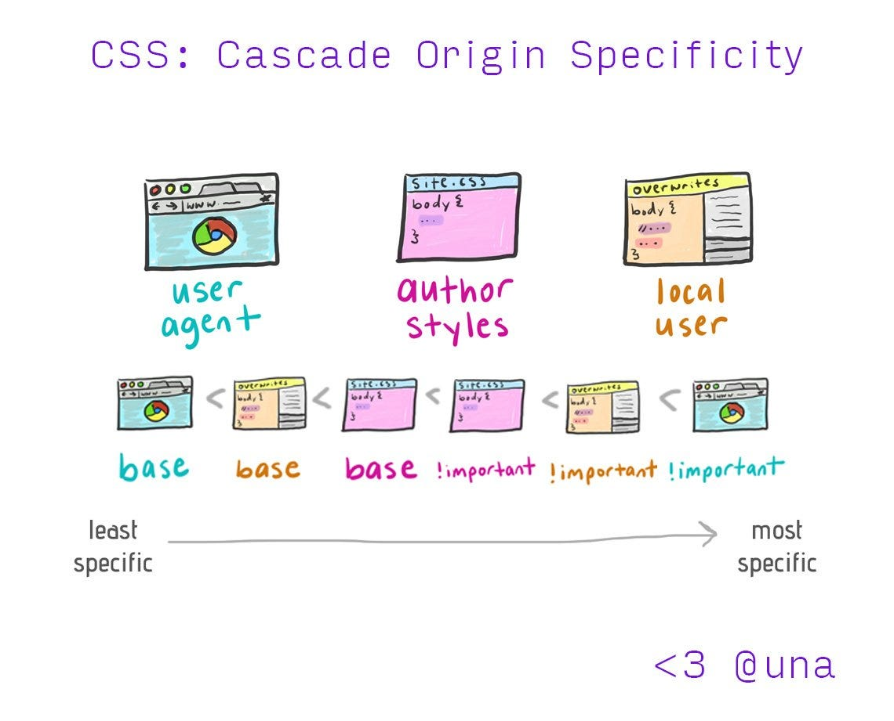
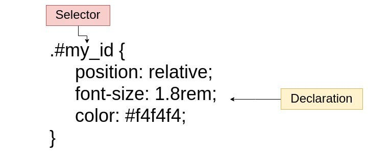
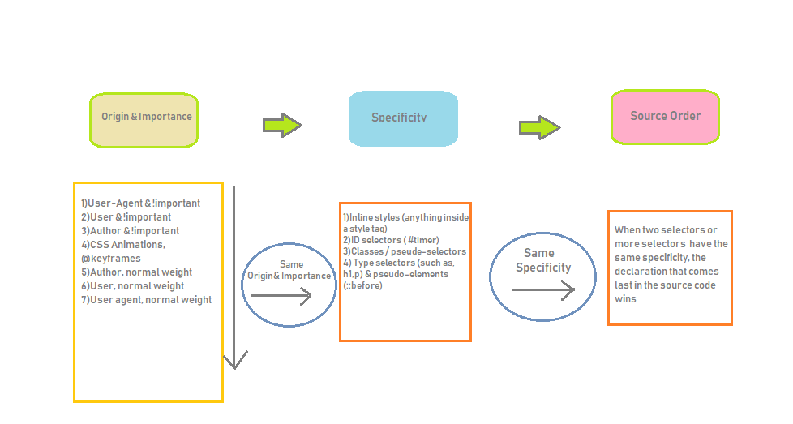
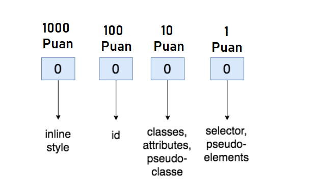
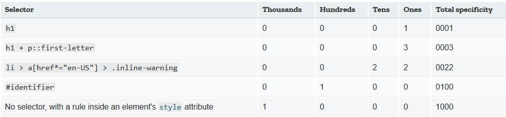
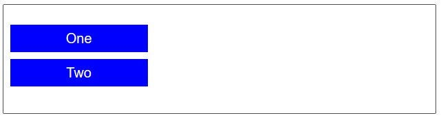
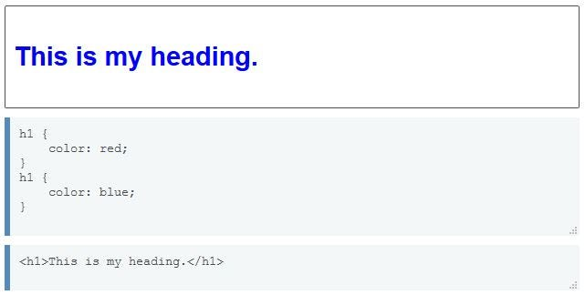

## CSS Specificity Nedir ?



_By Una Kravets_

Bu yazıda HTML elementlerine stil özellikleri eklenirken uygulanan Cascade algoritması üzerinde duracağım. Tarayıcımız hangi kaynaklardan style dosyaları çekiyor? Bir element için eşleşen birden fazla selector olduğunda hangi selector’un uygulanacağına nasıl karar veriyor ? gibi soruları örnekler vererek yanıtlamaya çalışacağım.

Basit olarak bir CSS Rule’nda bulunan CSS terimlerini hızlıca inceleyelim.



_By [Manisha Basra](https://medium.com/@jscodelover?source=post_page-----aca7152b4e7e----------------------)_

Şimdi yazımıza geçebiliriz.

Bir proje üzerinde çalışıyorsunuz ve bir elemente uygulanması gereken CSS Rule’un çalışmadığını görüyorsunuz. Genellikle sorun aynı elemente birden fazla _rule_ tanımlanması ile oluşuyor. Bir element için birden fazla _rules_ var iken CSS neye göre bir _rule_ seçiyor?

**Cascade,** belirli bir element için birden fazla kural olduğunda farklı CSS sayfalarını birleştirir ve farklı CSS declarations arasında ‘conflict çözme’ işlemlerini yapar.

**Cascade algoritması**,CSS property’leri için doğru CSS declaration’ları seçmektir. CSS declaration’lar farklı kaynaklardan gelir. Bu kaynaklar **user-agent stylesheet, author stylesheet** ve **user stylesheet.** Bunları açıklayalım.

**1)User-agent stylesheet(Default stylesheet)**: Tarayıcı, herhangi bir HTML sayfasına default bir style veren bir style sayfasına sahiptir. Bu stylesheet tarayıcıdan tarayıcıya farklılık gösterir. Tarayıcılar bu stylesheet’in üzerinde değişiklik yapılmasına izin verir. Veya bu stylesheet tamamen kaldırılabilir de.

**2)Author stylesheet:** En yaygın stylesheet ‘dir. Geliştiriciler tarafından belirli bir web sayfası için yazılan stylesheet dosyalarıdır. Kendi içinde 3 çeşidi vardır.

**2.1) Author Inline stylesheet**: Elementin içine yazılan CSS Rules. Aşağıdaki örnek gibi

```html
<div style="font-family: monospace; color: red;">
  <p>inheritance can be super useful!</p>
</div>
```

**2.2)Author embedded stylesheet** : HTML dosyası içine yazılan CSS Rules. Aşağıdaki örnek gibi:

```html
<style>
 p {
 font-family: georgia, serif;
 font-size: x-small;
 }
 hr {
 color: #ff9900;
 height: 1px;
 }
 a:hover {
 color: #ff0000;
 text-decoration: none;
 }
</style>
```

**2.3)Author external stylesheet** : Geliştirici oluşturduğu style dosyasını HTML dosyasına linkler:

```html
<link rel=”stylesheet” href=”styles.css”>
```

**3)User stylesheet** : Tarayıcı üzerinde kullanıcı tarafından oluşturulan ayarlardır. Örneğin tarayıcıda yazı tipi boyutunu ayarlama.

### CASCADE algoritması Conflict’i nasıl çözer?



Tarayıcınız yüklenen HTML sayfasını ilk olarak parse eder ve ondan bir DOM ağacı oluşturur. CSS selector, bu ağaçtaki elementlerle eşleşip onlara stil özelliklerini verir. Eğer bir element birden fazla _rule_ ile eşleşiyorsa sırasıyla yukarıdaki görseldeki işlemler başlar. Bu işlemlerin hepsinin bir ağırlık puanı var gibi düşünebiliriz. Ağırlık puanı en yüksek olan _rule_ elemente atanacaktır. Ağırlık puanı soldan sağa ve yukarıdan aşağı azalır. Yukarıdaki 3 aşamayı örnekler ile inceleyelim.

**Origin & Importance**

Bir CSS declaration’da importance, property sonuna eklenen !important ifadesiyle sağlanır. !important ifadesi eklendiğinde Cascade algoritmasını atlar ve !important yazılı rule çalışır. Cascade algoritmasını atladığı için önerilmez. !important kullanarak kod yazdığınız da bunu override etmesi zor olacağı için ileride size sıkıntılar çıkarabilir. Eklenti olarak Author stylesheet kullanıyorsanız(Bootstrap,Semantic UI gibi) Framework’ten gelenleri ezmek için kullanılabilir.

Burada Origin’den kastımız yukarıda açıkladığımız stylesheet kaynaklarıdır.(User-agent stylesheet,User stylesheet,Author stylesheet). Bu kaynakların da öncelikleri vardır. Bu kaynak önceliklerine ve Importance dikkate alındığında aşağıdaki liste ortaya çıkar. Önceliği yüksekten düşüğe doğru gitmektedir.

1.  User-Agent & !important
2.  User & !important
3.  Author & !important
4.  CSS Animations, @keyframes
5.  Author, normal weight
6.  User, normal weight
7.  User agent, normal weight

Bir input elementi oluşturulduğunda tarayıcıdan gelen style dosyası geçerli olacaktır. Ancak seninput elementine style tag’i ekleyip property’lerini yazdığında bu tag içerisindeki style geçerli olacaktır.

```css
.btn{
  padding: 10px 20px;
  font-size: 20px;
  background-color: #000 !important;
}

.para .login .btn{
  background-color: #fff;
}
```

[https://gist.github.com/jscodelover/5781b1fc4dbe99bb773c42f2c6f20662#file-important\_keyword-css](https://gist.github.com/jscodelover/5781b1fc4dbe99bb773c42f2c6f20662#file-important_keyword-css)

Bu örnektespecificity (Aşağıda açıklayacağım bu kavramı) olarak alttaki declaration geçerli olması gerekirken !importantkeyword’ü kullanıldığı için buton rengini üstteki _rule_ belirleyecektir.

**Specificity**

Bizim Origin & importance önceliklerimiz iki _rule_ içinde aynı ise bir sonraki aşama olan specificity ‘e bakarız. Specificity’i türkçeye spesifik olarak çevirebiliriz. Bizim tarayıcımız CSS declaration’a bakarak en spesifik selector’u seçecek. Specificity değerlendirilirken CSS selector sayısı ve Selector tiplerine bakılır.

1.  **Inline styles** (highest specificity): Bir elemente doğrudan style attribute ile stil verilir. : <h1 style=”color: #ffffff;”>.
2.  **IDs**: Sayfadaki elementler için unique bir tanımlayıcıdır.Örneğin#navbar.
3.  **Classes, attributes, and pseudo-classes**: Bu kategori .classes, \[attributes\] ve pseudo-classes(:hover, :focus gibi) içerir.
4.  **Elements and pseudo-elements** (lowest specificity): Bu kategori element isimlerini ve pseudo-elements içerir. Örneğin h1, div, ::before ve::after gibi.

Tarayıcının Specificity nasıl hesapladığına bakalım. Farklı selector türlerine, puan cinsinden bir değer verilir. Bu puanlar karşılaştırılarak en yüksek puana sahip selector Specificity olarak belirlenir.



Specificity hesaplarken yukarıdaki puanları kullanacağız.



_Example Calculation_

```css
/* specificity: 0101 */
#outer a {
    background-color: red;
}

/* specificity: 0201 */
#outer #inner a {
    background-color: blue;
}
```

```css
/* specificity: 0104 */
#outer div ul li a {
    color: yellow;
}
```

```css
/* specificity: 0113 */
#outer div ul .nav a {
    color: white;
}
```

```css
/* specificity: 0024 */
div div li:nth-child(2) a:hover {
    border: 10px solid black;
}
```

```css
/* specificity: 0023 */
div li:nth-child(2) a:hover {
    border: 10px dashed black;
}
```

```css
/* specificity: 0033 */
div div .nav:nth-child(2) a:hover {
    border: 10px double black;
}
```

```css
a {
    display: inline-block;
    line-height: 40px;
    font-size: 20px;
    text-decoration: none;
    text-align: center;
    width: 200px;
    margin-bottom: 10px;
}
```

```css
ul {
    padding: 0;
}
```

```css
li {
    list-style-type: none;
}
```

```html
<div id="outer" class="container">
    <div id="inner" class="container">
        <ul>
            <li class="nav"><a href="#">One</a></li>
            <li class="nav"><a href="#">Two</a></li>
        </ul>
    </div>
</div>
```

Specificity puanlarımız belli, şimdi sayfamızın çıktısında neler olacağını tahmin edelim. <a> tagında içerisindeki metnin arka planı mavi renkte olacak. Metnin rengi beyaz olacak çünkü en spesifik selector’ler bunlar. Mouse Two yazısının üzerine getirdiğimizde de border oluşacak. Aşağıda çıktımız görünmektedir.



Elementimiz ile eşleşecek en spesifik selector bu şekilde seçilir.

**Source Order**

Eğer senin bütün selector’lerin aynı specificity değerine sahipse. En son declaration geçerli olacaktır.



Bu işlemlerin ardından elementlerimize style özellikleri veriliyor. CSS Cascading algoritması bu şekilde çalışıyor. Umarım yazım sizin için faydalı olmuştur.

Twitter: cihatata

Yazımı yazarken yararlandığım kaynakların listesi

1.  [https://developer.mozilla.org/en-US/docs/Learn/CSS/Building\_blocks/Cascade\_and\_inheritance](https://developer.mozilla.org/en-US/docs/Learn/CSS/Building_blocks/Cascade_and_inheritance)
2.  [https://blog.logrocket.com/how-css-works-understanding-the-cascade-d181cd89a4d8/](https://blog.logrocket.com/how-css-works-understanding-the-cascade-d181cd89a4d8/)
3.  [https://medium.com/better-programming/how-does-css-works-behind-the-scenes-aca7152b4e7e](https://medium.com/better-programming/how-does-css-works-behind-the-scenes-aca7152b4e7e)
